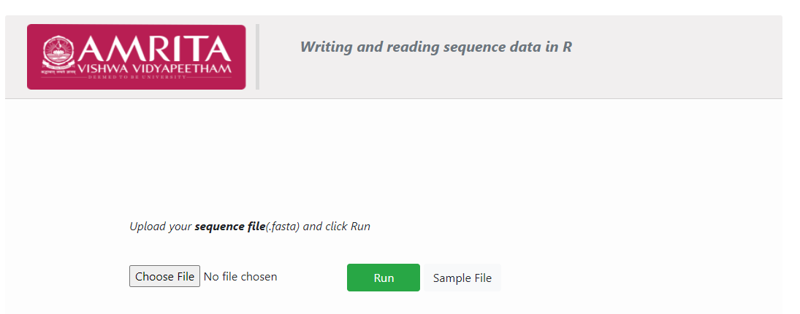
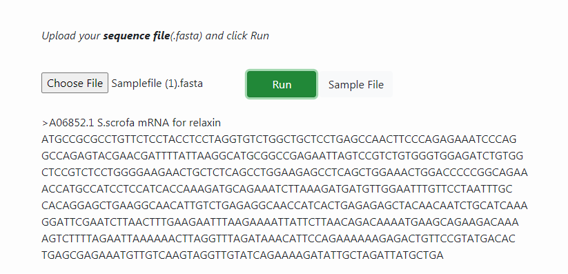

**Procedure to Work Simulator**
 

* 1.	Click on choose file button. Upload sequence of user’s interest in sequencefile.fasta format.

* 2.	User can also download default sample file provided in the user interface and load the sample file in .fasta format.

* 3.	Click on Run button for executing simulation. 

* 4.	The nucleotide sequence of mRNA for relaxin is given as output.

* 5.	User can choose .fasta file of varying proteins and nucleotides and can read the sequence in R platform.

&ensp;

**Description:** 

The common functions, `read.csv` and `write.csv`. are using in R programing for reading and writing coma separated files. Here, we are also using these functions for reading and writing our sequence files. This is not a systematic way of accessing sequence file like FASTA and genbank, in R programing. Using the read.csv function, user can read the sequence data in a file and assign to a variable named `dnaseq`. With the function write.csv, user can write a sequence data into a sequence file.s

&ensp;

**DIY**

**Installing R on Personal computers**
 

 

Go to http://ftp.heanet.ie/mirrors/cran.r-project.org.

 Download R for Linus/ Mac OS X/windows

To install R on Macintosh or computer running Linux chose specific R installer http://ftp.heanet.ie/mirrors/cran.r-project.org and follow the instructions provided to complete installation process.

After completing installation, check the R icon on the desktop. Or else From Start button, chose All programs and start R from the menu bar. The R console will pop-up in the user computer interface.

R has some standard packages installed, moreover additional R packages such as `rmeta` package can also be installed by the user-end.

 `Install package(s)` needed by the user from the `Packages` menu at the top of the R console. Bioconductor packages, additional R packages for bioinformatics, can be installed from http://bioconductor.org/biocLite.R
 

&ensp;

**Running R in personal computer**
 

User can provide R commands into the R console for programming.

                >
This represents an R prompt, then type commands for a task to be performed and the results will be tabulated immediately.

Objects are variables either scalars, vectors arrays, data frames, tables, lists and matrices created in R. Arrow represents values assigned to a particular variable.
Example of a scalar variable :

                > x <- 2*3

View the contents on R object by typing its name

                > x

 Example of a vector variable: 

Use the c()(combine)function to create a vector.

Suppose if the user is creating a vector named myvector, give the values of the elements as follows:

                > myvector <- c(7, 5, 8, 11, 4)

Type myvector to see the contents of the variable.
  
                > myvector [1] 7, 5, 8, 11, 4, 

where the number in the square bracket represents the index of the element. 

If the user need to  extract 2 element of the variable, type as 
                
                > myvector[2]

List contain both numeric and character elements. It can also include variables as vectors. Create mylist as 

        > mylist <- list(name="John", wife="Julie", myvector)

Print the contents of the list mylist by typing its name as

                   > mylist $name [1] "John"
                $wife [1] "Julie" [[3]][1] 7, 5 ,8 ,11 ,4

For table variable, first  create a vector variable mynames containing the name, for example the name of members in a family. Use table function table() function to read the names in the table list
              
              > mynames <- c("Mary", "John", "Ann", "Sinead", "Joe", "Mary", "Jim", "John", ?"Simon")
              > table(mynames)
              
               mynames
                   Ann Jim Joe John Mary Simon Sinead
                    1 1 1 2 2 1 1

User can store the table variable produced by the function table(), and call the stored table `mytable`, by following the command > mytable <- table(mynames)
Using the attributes() function, user can ?nd out the names of the named elements in a list.

                   > attributes(mylist) $names [1] "name" "wife" ""

Arguments, which are input variables can be provided to carry out mathematical operations.

                   > log10(1000)

help() function will provide the user  information about the function to be calculated.
        
                    > help.search("deviation")

function sd() in the `stats` package, which available with R installation, calculates  the standard deviation.

RSiteSearch()function provide the basic information of all the functions described on the R website.

To calculate the average of myvector, follow > mean(myvector)

Uisng the basic knowledge on R programming, user can create functions for calculating complex mathematical operations also.

Follow, 
        
                        > q() 
        
to quit from R interface.
 

 
